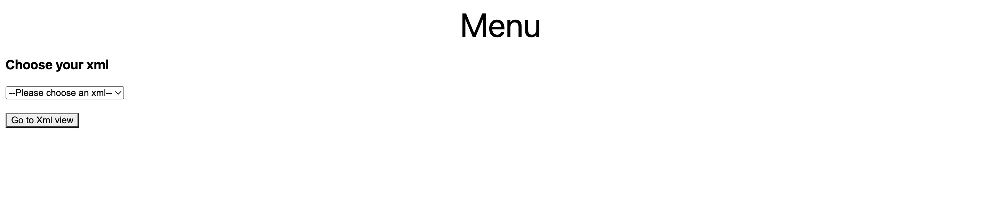
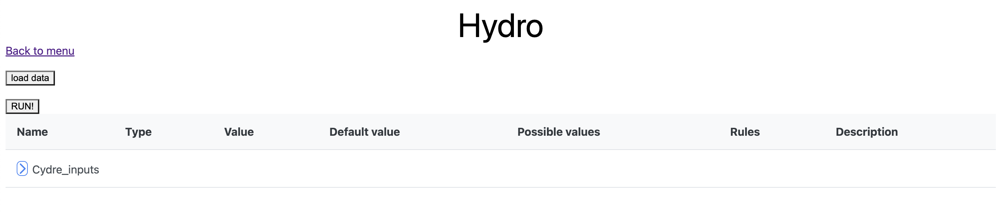
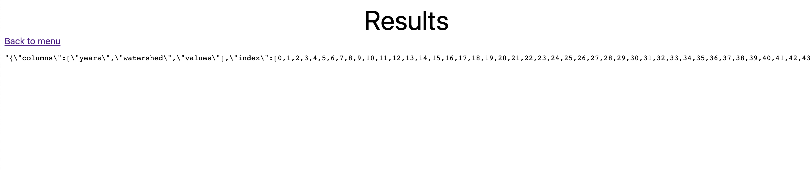

# How to setup the project

## Requirements

Make sure you have nodejs and npm installed as well as angular cli.

npm is included with nodejs and you can install angular cli with:

```
npm install -g @angular/cli
```

On Windows -> the requirements above and:
-install visual studio and check the “desktop developpement in c++” mark
-have python installed

## 1. Backend

### Using the fake back-end

For the 'mock' back-end, go into `backEnd`.
You have to install:
`pip install flask flask_cors plotly`


### Using the real back-end (not required)


fork/clone the followed git: https://gitlab.com/dreuzy/cydre

Then go to cydre/doc/ and open "guide d'installation", follow the instructions.

For running the Python you need python 3, conda and a Python environment dedicated for the app:

```
conda create -n CYDRE python=3.8
conda activate CYDRE
```

You also need the following Python packages (at least) packages:

```
conda install -c conda-forge werkzeug
conda install -c conda-forge proj
conda install -c conda-forge proj-data
conda install -c conda-forge gdal
conda install gdal libgdal
conda install scipy numpy raster2xyz rasterio whitebox
conda install flask_cors
conda install libgcc
```

You finally need to put a path variable in you rc file.
For example, put in your .zshrc or your .bashrc file the following line (to update to match the path to the folder that contains the Cydre project):

`export CYDRE=/path/to/the/folder/that/contains/cydre`

You can then activate your conda environnement and launch the backend by going to cydre/launchers/ and run:

```
python run_cydre_with_api.py
```

## 2. FrontEnd

When you have the right requirements, go to frontEnd/front/ and execute:
```
npm install
```
to install all the dependencies.

```
ng serve
```
to launch the angular project. Go to http://localhost:4200/ on a web Browser to see the result.

## 3. Basic use case

Choose an xml from the list and click the "go to xml view" button


Then click the "load data" to load the xml. You can then go through it by clicking the little blue arrows


Click on the "RUN!" button to launch the python application on the server side. It can take some time to complete. You will see the result as a json at the end. Not really practical but it shows that the python application did run and returned us a result.


If you want to change the xml, you will have to come back to the menu with the "back to menu" link and follow the same instructions as before.